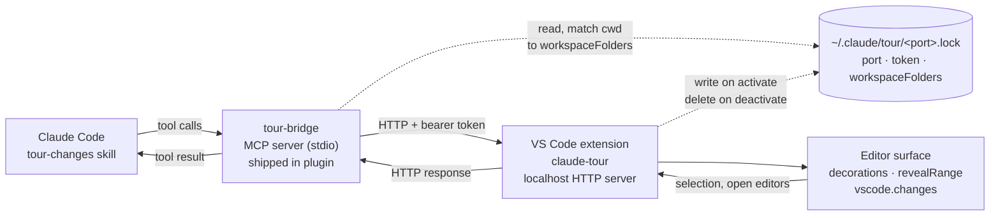

# Diagram

```mermaid
flowchart LR
    C["Claude Code<br/>tour-changes skill"]
    M["tour-bridge<br/>MCP server (stdio)<br/>shipped in plugin"]
    L[("~/.claude/tour/&lt;port&gt;.lock<br/>port · token · workspaceFolders")]
    E["VS Code extension<br/>claude-tour<br/>localhost HTTP server"]
    V["Editor surface<br/>decorations · revealRange<br/>vscode.changes"]

    C -->|tool calls| M
    M -.->|read, match cwd<br/>to workspaceFolders| L
    E -.->|write on activate<br/>delete on deactivate| L
    M -->|HTTP + bearer token| E
    E --> V
    V -->|selection, open editors| E
    E -->|HTTP response| M
    M -->|tool result| C
```