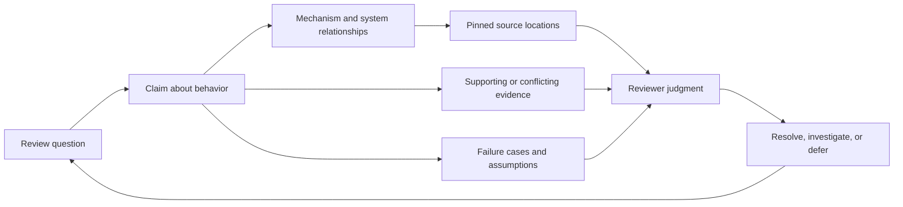

# A proposed evidence-informed review model for Kankō

Version 0.1 · 24 September 2026 · Research proposal, not an implemented or validated tour policy.

Kankō should help a reviewer build an accurate model of the changed behavior, test the important claims about it, and make a decision whose confidence matches the available evidence. A successful tour leaves the reviewer able to continue reasoning about the change without the narrator.

The accompanying [evidence review](review-evidence.md) documents sixteen primary studies, one emerging preprint, their methods, findings, limitations, and sources. It includes negative and mixed results. The proposal below is a synthesis: its exact structure, adaptation rules, and evaluation criteria are design hypotheses. No study validates this complete model.

The literature changes three parts of the initial proposal. Grouping related material has a clearer rationale than prescribing one traversal direction. Additional guidance has mixed benefits and should earn its cost. AI explanations need to be evaluated for the attention they direct and the errors they leave unnoticed, as well as the understanding they enable. These conclusions draw on the [ordering theory](https://tobiasbaum.github.io/rp/optimalordering.pdf), its [experimental test](https://link.springer.com/article/10.1007/s10664-018-9676-8), the [guidance experiment](https://link.springer.com/article/10.1007/s10664-022-10123-8), and the [AI review study](https://arxiv.org/html/2411.11401v3).

**Use a review question as the unit of organization.** A review question identifies something a person must understand or assess, such as whether a retry can duplicate an operation. Each question connects the relevant behavior, implementation, assumptions, possible failures, and evidence. Files and diff hunks supply the material for answering it. Some questions need several files; some files participate in several questions.

This is a proposed operational response to the information needs found by [Tao et al.](https://people.csail.mit.edu/hunkim/papers/tao-fse2012.pdf) and [Pascarella et al.](https://sback.it/publications/cscw2018.pdf). It should replace “commit-message-worthy” as the primary test of a stop's usefulness. A coherent implementation unit can still leave a reviewer without an answer to the question that matters.

**Represent both the system and the argument for the change.** These are two views of the same material, not a proposal for two new databases. The system view explains participants, responsibilities, state ownership, transitions, contracts, and observable outcomes. The review view records claims about that behavior, supporting or conflicting evidence, assumptions, questions, and unresolved risks. The tour connects the two.



The diagram is a proposed information model. It is not a causal model validated by the cited studies. In particular, a source link establishes where a statement came from; it does not establish that the statement is true. A correct source reference can accompany an incorrect interpretation.

**Separate grouping, entry point, and depth.** First group material that must be considered together. Then choose a starting point appropriate to the change and reviewer. Finally choose the amount of explanation. These decisions can vary independently: a short tour and a detailed tour can use the same groups, while starting at different questions. Observed variation in [review orders](https://azaidman.github.io/publications/bouraffaEASE2025.pdf) supports this flexibility, while the [decomposition experiment](https://research.tudelft.nl/en/publications/the-effects-of-change-decomposition-on-code-reviewa-controlled-ex/) cautions against assuming grouping improves every review outcome.

The proposed review proceeds through the following activities. They can repeat or overlap; they do not require six stops or six recited headings.

| Activity | What the reviewer needs to gain | What the model prepares |
| --- | --- | --- |
| Orient | A concrete problem, intended outcome, and review scope | Before/after scenario, exact candidate, source of intent, important uncertainty |
| Map | Enough context to locate the change in the system | Participants and responsibilities; relevant state, calls, data flow, and external boundaries |
| Inspect | An explanation of how the changed mechanism produces its result | A route through cohesive review questions, with tightly scoped source and evidence |
| Challenge | A way to test the explanation and detect omissions | Relevant counterexamples, assumptions, alternative designs, and unexamined areas |
| Integrate | An account of the combined behavior across the stops | An end-to-end trace, boundary interactions, and reconciliation with the change inventory |
| Decide | A judgment consistent with what was checked | Supported claims, unresolved questions, remaining verification, and explicit human outcome |

A small fix may cover these activities in one stop. A cross-service migration may revisit mapping and challenge several times. Understanding and knowledge transfer are review outcomes supported by the [Microsoft study](https://www.microsoft.com/en-us/research/wp-content/uploads/2016/02/ICSE202013-codereview.pdf) and [Google study](https://storage.googleapis.com/gweb-research2023-stg-media/pubtools/4476.pdf); the six-activity structure is Kankō's proposed way to support them.

**Choose the route with a small amount of explicit judgment.** Before writing narration, establish the change's purpose, the reviewer's stated familiarity and goal, the relationships that are hardest to inspect, the most consequential plausible failure, and the evidence available. When reviewer familiarity is unknown, provide a brief orientation and allow correction. Do not infer understanding from job title or from clicking Next.

Keep connected material adjacent and present prerequisites when they are actually needed. Bring a consequential uncertainty forward once enough context exists to assess it. Avoid a long foundation-first preamble that postpones every risky part until the end. Explain the route in one sentence and allow the reviewer to redirect it. These are heuristics to test, not an “optimal order” claim. The [file-position experiment](https://eprints.gla.ac.uk/273443/3/273443.pdf) supplies a reason to take attention allocation seriously.

| Change or dominant concern | Candidate entry point and route | Question that must remain visible |
| --- | --- | --- |
| Bug fix | Failing scenario → cause → correction → neighboring cases → regression evidence | Which condition caused the failure, and what prevents recurrence? |
| New behavior | User or caller action → boundary contracts → changed mechanism → outcome → exceptions | Can the intended outcome be reached through the real entry point? |
| Refactor | Behavior that must remain stable → moved responsibilities → representative old/new paths → equivalence evidence | Which observable differences would violate the refactor's promise? |
| API, schema, or data migration | Existing consumers/data → changed contract → producer/consumer compatibility → transition and recovery | What happens while versions or data formats coexist? |
| Concurrency, persistence, or reliability | State owner → competing events → ordering/atomicity → partial failure → recovery | What if operations overlap, repeat, or stop halfway? |
| Security-sensitive behavior | Protected resource → trust boundary → allowed/denied paths → bypass candidates → evidence | Where is the rule enforced, including alternative entry points? |
| Performance | Representative workload → measured cost → changed mechanism → comparison → resource tradeoffs | Is the measured benefit relevant, and what becomes more expensive? |
| Broad mechanical change | Transformation rule → representative examples → exceptions → completeness evidence | Does the rule hold everywhere, including unusual cases? |

This table is a proposed repertoire, not an empirical taxonomy of optimal tours. Mixed PRs can combine routes. For example, explain a new feature through its user action, then inspect its persistence step through failure and recovery. Starting with tests can help express expected behavior, but test-first review has [documented tradeoffs](https://sback.it/publications/icse2019a.pdf); it is not a universal requirement.

**Prepare each stop as a compact, inspectable argument.** The following is planning notation, not a new tool schema or mandatory spoken template:

```text
Question: What does the reviewer need to resolve here?
Claim: What behavior or property is proposed, and under what conditions?
Context: What must be understood first, including relevant unchanged code?
Mechanism: Which source locations establish the explanation?
Challenge: What plausible input, sequence, or boundary could invalidate it?
Evidence: What was actually checked, on which candidate, with what limits?
Connection: What does this establish for the rest of the change?
Status: What is supported, contradicted, unknown, or deferred?
```

Narration should tell a connected story through this material and show only what serves the current question. Define unfamiliar domain terms when they become necessary. Avoid paraphrasing straightforward syntax. Keep comparison points visible together when useful. The [Ivie study](https://arxiv.org/html/2403.02491v1) offers adjacent evidence for explanations located near code; it does not validate whole-PR comprehension or Kankō's current anchor limits.

Challenge means selecting plausible conditions from the actual mechanism. It does not require manufacturing a concern or listing every failure mode. For a risky asynchronous operation, compare event orders. For a rename, inspect exceptional references and generated outputs. For a simple text change, a brief inspection may be sufficient.

**Use evidence that matches the claim.** The distinctions below are proposed reporting rules:

| Claim | Relevant support | Important limitation to state |
| --- | --- | --- |
| A branch handles a boundary input | Source inspection and an exercised example | Inspection alone is not an observed execution |
| A regression is prevented | A reproducer or regression check with a meaningful failing baseline | A new passing test can miss the original failure |
| A user can complete a workflow | Observation through the relevant consumer interface | Lower-level tests support narrower claims |
| Callers remain compatible | Contract checks and evidence from affected consumers | One caller does not establish all callers |
| A refactor preserves behavior | Representative comparisons and checks aimed at changed boundaries | Existing tests may leave important behavior uncovered |
| A change improves performance | Comparable measurements with workload and environment identified | Results may not generalize outside that workload |

Keep authored intent, model inference, source observation, execution results, and human judgment distinguishable. A test definition is not a run result; a reported result may be stale; a green check can cover a narrower claim than the narration makes. If the model also wrote the implementation, its explanation is not independent corroboration. Uncertainty should be attached to the relevant claim, where the reviewer can act on it.

**Preserve independent inspection without making every stop an exam.** Keep the complete change inventory reachable, explicitly identify areas outside the guided route, and allow exploration without losing the current question. At a consequential boundary, a concrete prompt such as “Consider cancellation arriving after the write—where would cleanup occur?” can make the assumption inspectable. Do not require ritual comprehension confirmations. Known findings should remain available; [existing-comment research](https://gulcalikli.github.io/files/priming.pdf) does not support a blanket policy of hiding other reviewers' observations.

Selective checking is a design hypothesis informed by the [cognitive-forcing study](https://arxiv.org/html/2102.09692v1) and research on the [cost of verifying explanations](https://arxiv.org/html/2212.06823v2). Both use non-code tasks, so Kankō must test the transfer. Source access, concise evidence, and freedom to challenge the narrator should reduce the cost of checking. Interruptions that do not improve decisions should be removed.

**Integrate the change before closing.** Follow one representative scenario across the relevant stops, then inspect important interactions between them. Reconcile the tour with a manifest of changed behavior, source, tests, configuration, dependencies, generated material, and deletions. Every changed region should have a disposition: examined in a stop, grouped under a checked mechanical rule, deferred for a stated reason, or outside an explicitly agreed scope. This is coverage accounting, not proof of comprehension or defect freedom.

An exposed source location, an acknowledged stop, a supported claim, an accepted risk, and approval are different facts. Preserve these differences. The reviewer can finish a useful tour with unresolved questions or request changes. A missing specialist or unavailable integration environment should remain a named gap; the model should not manufacture certainty to close the session.

**A worked example shows the level of explanation intended.** Consider a hypothetical fix for a stale asynchronous result replacing newer editor content. This example illustrates the model; it is not a finding about the current Kankō implementation.

| Stop question | Source and evidence to bring together | What the reviewer should be able to reason about |
| --- | --- | --- |
| What sequence produces the wrong display? | Two overlapping requests, their completion order, and the visible result | A request can complete successfully and still be obsolete |
| Who owns the decision to accept a result? | Request identity creation, state owner, and the final write site | Where freshness must be checked to protect the actual mutation |
| Does the correction protect all completion paths? | Success, error, cancellation, and disposal paths | Whether a check on one path leaves another path exposed |
| What establishes the behavior after the fix? | A forced out-of-order regression case and a consumer-level observation | What the evidence establishes and which variants remain unchecked |

An unhelpful stop would merely list a new counter, a comparison, and a test. The proposed stop instead explains the event sequence, locates ownership, and gives the reviewer a way to falsify the safety claim. Its conclusion might be: the delayed-success case is demonstrated; the error path is supported only by inspection; disposal has not yet been checked. That is a useful review state even before approval is possible.

**Kankō already has much of the necessary representation.** This assessment is based on repository commit `4f66b0bda21138ef03ab7eb62dee2d73c1a4c548`. The [tour skill](../../skills/kanko-tour/SKILL.md), [build skill](../../skills/kanko-build/SKILL.md), [tour contract](../kanko-v2-tour-model.md), and [schema](../../schemas/tour-plan.schema.json) already provide pinned sources, claims and risks, provenance, evidence references, stops, beats, and reviewer-controlled navigation. This research change modifies none of those contracts.

The first implementation experiment should change planning and narration guidance in both skills together. Introduce review questions and route selection; broaden concern discovery to behavioral and operational failure; and require a final coverage reconciliation. Retain current source validation, persistence, and explicit review outcomes. Keep the new planning notation in existing prose/relationships initially. Add structured fields only if evaluation shows the product needs to query or enforce them. Do not treat illustrative fields above as accepted `CreateTourPlan` arguments.

Because the current skills prepare the complete plan before loading, adaptation needs an explicit boundary. Extra explanation within an existing stop can remain conversational. A changed itinerary should be persisted and validated through the supported plan workflow before the displayed agenda claims to represent it. A source change requires the existing freshness/refresh process; conversational adaptation does not excuse stale anchors or silent reuse of review state.

**Evaluate the model on reviewer outcomes.** A valid plan and a persuasive explanation are insufficient acceptance criteria. Start with a small formative pilot to discover confusing language, missing context, and excessive guidance. That pilot can improve the design but cannot establish general effectiveness. Then compare three conditions: ordinary diff plus PR description, current Kankō guidance, and the proposed guidance.

Use multiple real or realistically reconstructed changes, including bug fixes, new behavior, refactors, and changes spanning boundaries. Include clean changes as well as known defects. Include cases where the tour omits an important caller/configuration change or offers a plausible but unsupported explanation. An independent expert should establish the expected behavior, defect set, and rubric before seeing the generated tour. The same model should not both invent the explanation and supply the sole answer key.

| Outcome | Proposed measurement | What it protects against |
| --- | --- | --- |
| System understanding | Explain responsibilities and predict an unseen input/event sequence using a scored answer key | Repeating the narrator's words without a usable model |
| Inspection quality | Detection of known defects by severity and location, plus false reports | Optimizing for comment volume or easy style findings |
| Decision quality | Incorrect approvals of defective changes and unjustified blocking of clean changes | “More skeptical” being mistaken for “more accurate” |
| Confidence calibration | Confidence for specific verifiable answers compared with their correctness | Feeling informed while being wrong |
| Coverage | Detection of seeded omissions and whether relevant untouched callers/boundaries are checked | Attention being limited to the narrated path |
| Usability and cost | Active review time, reported effort, useful exploration, and interruptions | A laborious process that reviewers abandon |

Score comprehension with a predeclared rubric: 0 for absent or wrong, 1 for a partly correct/local answer, and 2 for a correct relational answer grounded in source. Keep item-level results; do not turn the total into an approval threshold. For known-defect tasks, report recall and false positives separately. Navigation counts and self-reported understanding remain supporting observations, not substitutes for these outcomes.

Randomize and counterbalance condition/task order. Give each participant different changes across conditions to avoid learning the answer from an earlier review. Measure codebase familiarity and analyze experienced and unfamiliar reviewers separately. Keep source access, available test results, time constraints, and model version comparable. Record the actual generated plans, tool state, prompts, and any interventions. Score answers and findings without exposing the experimental condition when feasible; use two evaluators for ambiguous cases and record disagreements.

Choose confirmatory sample size and meaningful effect/non-inferiority margins after the pilot, before evaluating the final comparison. Account for repeated observations from the same reviewer and PR. Report effect sizes and uncertainty; a nonsignificant result is not proof of equivalence. The proposal succeeds only if it improves a predeclared understanding or inspection outcome while staying within the agreed limits for serious misses, false alarms, and burden. No confirmatory experiment has been run for this document.

The next tests should isolate the expensive assumptions: whether adapting the route beats a fixed route, whether connected source anchors help with defects spanning files, whether a coverage reconciliation catches omissions, and whether selective challenge prompts improve accuracy enough to justify their interruption. Keep a simpler variant when the additional structure does not earn its cost.
