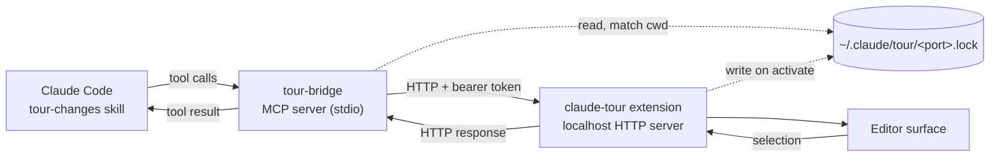

# tour-changes: editor bridge design

Date: 2026-09-21

## Problem

The `tour-changes` skill narrates a diff stop by stop, citing code as
`path:line`. The terminal renders those citations as clickable links, but the
reviewer still does the navigating. A real walkthrough is the opposite: the
author drives the screen, opens the file, and points at the lines while
talking.

This design gives the skill the ability to drive VS Code directly — open a
stop's files, highlight its ranges, point at a specific line mid-sentence, and
read back whatever the reviewer highlights when they interrupt with a question.

## Goals

- The skill opens and highlights code as it narrates, without the reviewer clicking anything.
- A stop spanning multiple files renders in VS Code's native multi-file diff editor.
- Within a stop, the skill can point at successively narrower ranges without re-opening files.
- When the reviewer highlights code and asks "what's this?", the skill can read the selection.
- Ships as an installable marketplace plugin that works across agentic coding tools, not Claude Code alone.

## Non-goals

- Graceful degradation when the extension is absent. The tour refuses to start instead.
- Editors other than VS Code. The *agent* is portable; the *editor* is not.
- A sidebar or tree view of stops. Reviewer-driven navigation is a later addition.
- Any write path. The bridge displays code; it never modifies it.

## Prior art and rejected approaches

**Claude Code's own IDE bridge.** The Claude Code VS Code extension runs an MCP
server over a WebSocket, discovered via `~/.claude/ide/<port>.lock`. It exposes
`openFile` (with `startText`/`endText` range anchors), `openDiff`,
`getCurrentSelection`, and `getOpenEditors` — close to exactly what this design
needs. Claude Code surfaces only `getDiagnostics` and `executeCode` to the
model, so using the rest would mean connecting to that WebSocket as a third
party.

Rejected after probing it live: informational tools (`getWorkspaceFolders`)
answer a third-party client, but every editor-manipulating tool accepts the
call and never replies. It is also undocumented, coupled to the extension
version, and shares a channel Claude Code itself depends on.

**`code` CLI shell-out.** `code --goto <file>:<line>:<col>` works and needs no
install, but places a cursor rather than highlighting a range, and cannot
decorate or clear. `code --open-url` is not supported in the WSL remote CLI
(build 1.138.0) — it treats the URI as a filesystem path and creates a
directory. That rules out URI-handler dispatch in this environment.

**CodeTour (`vsls-contrib.codetour`).** Renders authored `.tours/*.tour` files
as a navigable sidebar. Rejected: navigation is reviewer-driven rather than
author-driven, steps are line-anchored with no diff awareness, and there is no
path to read the reviewer's selection back.

**`estaples.git-vscode-diff`** is retained as-is. Its `changedFiles`,
`resourceTriple`, and `gitUri` helpers are lifted into the new extension for
the multi-file diff path.

## Architecture

Three processes, two hops. See `diagram.md` at the repository root for the
rendered flow.



The MCP server is a stateless proxy: resolve which editor window owns the
current working directory, forward the request, return the response. All editor
state lives in the extension.

HTTP rather than WebSocket because every interaction is request/response. A
future sidebar needing server push can add an SSE endpoint without disturbing
this.

## Pairing

The extension binds `127.0.0.1:0`, reads the assigned port, and writes
`~/.claude/tour/<port>.lock` with mode `0600`:

```json
{
  "protocolVersion": 1,
  "port": 53411,
  "authToken": "<random 32 bytes, base64url>",
  "pid": 1472,
  "ideName": "Visual Studio Code",
  "extensionVersion": "0.1.0",
  "workspaceFolders": ["/home/estaples/code/github.com/erstaples/example"]
}
```

The file is deleted on `deactivate`.

Resolution, performed by the MCP server on every call:

1. Read every `*.lock` in `~/.claude/tour/`.
2. Drop any whose `pid` fails `process.kill(pid, 0)` with `ESRCH`, unlinking the file.
3. Keep locks where the server's cwd is equal to, or contained by, one of `workspaceFolders`.
4. Exactly one survivor → use it. Longest matching prefix wins among nested workspaces.
5. Zero → error naming the likely cause (extension not installed, or workspace not open).
6. More than one after prefix comparison → error listing the candidate workspaces. Never guess.

`protocolVersion` mismatch between lockfile and MCP server is a hard error
naming both versions.

## HTTP protocol

All requests carry `Authorization: Bearer <authToken>` and
`{"protocolVersion": 1}`. The server binds loopback only and rejects requests
whose `Origin` header is present (defense against DNS-rebinding from a browser).

**Line numbers are 1-based and inclusive throughout the protocol**, matching git
and the editor gutter. Conversion to VS Code's 0-based `Position` happens at the
extension boundary and nowhere else.

**Paths are repository-relative**, resolved against the matched workspace folder
by the extension. This matches the skill's existing citation convention.

### `POST /stop`

Sets the scene for a tour stop.

```json
{
  "protocolVersion": 1,
  "label": "Stop 2 — extract the retry policy",
  "mode": "diff",
  "base": "main",
  "head": "HEAD",
  "files": [
    { "path": "internal/retry/policy.go", "ranges": [{ "startLine": 12, "endLine": 48 }] },
    { "path": "internal/client/do.go",    "ranges": [{ "startLine": 88, "endLine": 94 }] }
  ]
}
```

- `mode: "diff"` — opens the listed files in the native multi-file diff editor via the `vscode.changes` command, titled `label`. Requires `base` and `head`. Left side is a `git:` URI at `base`, right side at `head`; added files omit the left, deleted files omit the right.
- `mode: "file"` — opens the working-tree files as normal editors and applies the stop decoration to `ranges`.

Either mode replaces the previous stop's decorations. Response:

```json
{ "ok": true, "opened": ["internal/retry/policy.go", "internal/client/do.go"] }
```

### `POST /focus`

Points at one range inside the current stop. Reveals it with
`TextEditorRevealType.InCenterIfOutsideViewport` and applies the focus
decoration.

```json
{
  "protocolVersion": 1,
  "path": "internal/retry/policy.go",
  "startLine": 31,
  "endLine": 35,
  "note": "backoff is capped here, not in the caller"
}
```

`note`, when present, renders as inline `after`-text at the end of `endLine`.

Focus does not move the cursor or set `editor.selection`. The selection belongs
to the reviewer; overwriting it would corrupt what `GET /selection` reports.

### `POST /clear`

Clears both decoration types across all visible editors. Does not close tabs.

### `GET /selection`

```json
{
  "ok": true,
  "selection": {
    "path": "internal/retry/policy.go",
    "startLine": 31,
    "endLine": 35,
    "text": "…",
    "contextBefore": "…",
    "contextAfter": "…"
  }
}
```

`selection` is `null` when the active editor has an empty selection.
`contextBefore`/`contextAfter` carry 10 lines either side so the skill can
answer without a separate file read.

### `GET /status`

```json
{
  "ok": true,
  "protocolVersion": 1,
  "extensionVersion": "0.1.0",
  "ideName": "Visual Studio Code",
  "workspaceFolders": ["/home/estaples/code/github.com/erstaples/example"]
}
```

### Errors

Non-2xx responses carry `{ "ok": false, "error": { "code": "...", "message": "..." } }`.
Codes: `unauthorized`, `protocol_mismatch`, `bad_request`, `file_not_found`,
`range_out_of_bounds`, `git_failed`, `no_active_editor`.

## Decorations

Two `TextEditorDecorationType` instances, created once at activation and
disposed at deactivation. Clearing is `setDecorations(type, [])`.

| Type | Appearance |
|---|---|
| `stopRange` | Subtle whole-line background, gutter bar, `overviewRulerColor` so the stop's extent shows in the scrollbar ruler |
| `focusRange` | Stronger background, 1px border, optional `after` contentText carrying `note` |

Colors come from `ThemeColor` references rather than literals, so the
highlights track the reviewer's theme in both light and dark.

## MCP tool surface

Five tools, exposed by `mcp/server.js` over stdio.

| Tool | Args | Maps to |
|---|---|---|
| `tour_status` | — | `GET /status` |
| `tour_stop` | `label`, `mode`, `base?`, `head?`, `files[{path, ranges[{startLine, endLine}]}]` | `POST /stop` |
| `tour_focus` | `path`, `startLine`, `endLine`, `note?` | `POST /focus` |
| `tour_clear` | — | `POST /clear` |
| `tour_selection` | — | `GET /selection` |

`tour_focus` exists separately from `tour_stop` because re-opening a file for
every sentence is not what a human walkthrough looks like. The author opens once
and points repeatedly.

The protocol has no write verbs, so the skill's "never edit files" constraint
holds by construction rather than by instruction.

## Repository layout

```
claude-code-review-walkthrough/
├── .claude-plugin/
│   ├── marketplace.json
│   └── plugin.json
├── .mcp.json
├── skills/tour-changes/SKILL.md
├── mcp/
│   ├── server.js
│   └── lockfile.js
├── editor-extension/
│   ├── extension.js
│   ├── server.js
│   ├── decorations.js
│   ├── git.js
│   ├── package.json
│   └── README.md
├── test/
├── install.sh
├── diagram.md
├── README.md
└── LICENSE
```

`marketplace.json` declares a single plugin with `source: "./"`, matching the
shape of the author's existing `claudecode-taskw` repository.

`.mcp.json` registers the bridge:

```json
{
  "mcpServers": {
    "tour-bridge": {
      "command": "node",
      "args": ["${CLAUDE_PLUGIN_ROOT}/mcp/server.js"]
    }
  }
}
```

## Cross-agent compatibility

The bridge is a standard stdio MCP server, so any MCP-capable agent can drive
it. What varies between agents is how the *procedure* — the skill — gets
loaded, and how the server gets registered.

### Verified: Codex installs this plugin as-is

Probed against Codex CLI 0.155.1 by installing a synthetic plugin and
inspecting the result:

- `.claude-plugin/marketplace.json` is the manifest Codex accepts. `.codex-plugin/marketplace.json`, bare `marketplace.json`, and `.agent-plugin/marketplace.json` are all rejected with "marketplace root does not contain a supported manifest". No second manifest is needed, and adding one would not help.
- `skills/<name>/SKILL.md` loads unchanged. Codex namespaces entries as `plugin_name:skill_name` and surfaces them in the same skills list Claude Code uses.
- `.mcp.json` servers are registered and appear in `codex mcp list`.
- `commands/*.md`, if present, are auto-migrated into `.codex-plugin/migrated-command-skills/`.

The consequence is that the repository layout below needs no per-agent
duplication. One manifest, one skill file, one MCP registration.

### The `${CLAUDE_PLUGIN_ROOT}` question

`codex mcp get` displays the variable unexpanded, but the `codex` binary
contains the string `CLAUDE_PLUGIN_ROOT` (and no `CODEX_PLUGIN_ROOT`), which
suggests it substitutes at launch. **This is the one unverified assumption in
the cross-agent story** and must be confirmed during implementation by
launching a server that logs its own resolved path.

If it does not substitute, `install.sh` registers the server explicitly with an
absolute path resolved at install time:

```
codex mcp add tour-bridge -- node "$PLUGIN_ROOT/mcp/server.js"
```

This fallback is cheap, so it is worth shipping the check in `install.sh`
regardless: detect a literal `${CLAUDE_PLUGIN_ROOT}` in `codex mcp get
tour-bridge` output and re-register if found.

### Agents without a plugin system

Cursor, Gemini CLI, Windsurf, and similar tools have no plugin manifest but do
support stdio MCP servers. Their install path is two manual steps: register
`node <abs>/mcp/server.js` in the tool's MCP config, and point the tool's rules
file at `skills/tour-changes/SKILL.md`.

`SKILL.md` is the single source of truth for the procedure. It is not
duplicated into `AGENTS.md`, `.cursor/rules`, or any per-agent variant —
the README instructs users to reference the file rather than copy it, so there
is nothing to drift.

### Constraints this places on the skill body

The skill must not assume Claude Code specifics. Concretely: no references to
sibling Claude skills by slash name (the current draft points at
`/code-review` and `address-coderabbit`), no assumptions about Claude Code's
tool names beyond the `tour_*` MCP tools, and no reliance on terminal rendering
behavior. Path citations stay, since every agent's terminal renders them
usefully or harmlessly.

### Zero dependencies on both sides

Plugin installation does not run `npm install`, so depending on
`@modelcontextprotocol/sdk` would require vendoring `node_modules` into the
repository. MCP over stdio is line-delimited JSON-RPC 2.0 with three methods
(`initialize`, `tools/list`, `tools/call`) — direct implementation is roughly
150 lines. The extension side has no dependencies either, matching
`git-vscode-diff`.

Consequence: `node` must be on `PATH` for whichever agent launches the server.
`install.sh` checks for `node` and the `code` CLI, installs the packaged
`.vsix`, and then — for each agent it detects — verifies the MCP registration,
re-registering with an absolute path if variable substitution did not happen.

## Skill changes

`SKILL.md` moves to `skills/tour-changes/SKILL.md`, which also resolves the
lint warning that the skill name must match its containing folder.

Voice generalizes from "Eric" to second person, and trigger phrases in the
frontmatter `description` become generic. References to sibling Claude Code
skills are removed per the cross-agent constraints above.

Workflow changes:

- **Step 1** gains a `tour_status` preflight. If the bridge is unreachable, the tour refuses to start and reports the reason. No text-only fallback.
- **Step 4** calls `tour_stop` before narrating each stop, and `tour_focus` when zooming into a specific construct mid-narration.
- **Question handling** calls `tour_selection` first when the reviewer's question is deictic ("what's this?", "why here?", "what does that call do?"), so the answer lands on the code they are looking at.
- **Step 5** ends with `tour_clear`.

The `path:line` citation rule is retained. Terminal links and driven editor
serve different moments: the citation survives scrollback, the highlight does
not.

## Testing

**MCP server** — unit tests over the JSON-RPC framing and lockfile resolution,
against a fake lock directory: zero locks, one lock, multiple locks with nested
workspace folders, a stale lock whose pid is dead, a lock with a mismatched
`protocolVersion`. HTTP forwarding is tested against a stub server.

**Extension** — `@vscode/test-electron` integration tests driving the HTTP
surface in a real Extension Development Host: `/status` shape, `/stop` in both
modes opening the expected tabs, `/focus` range conversion at file boundaries
(line 1 and last line), `/selection` with and without an active selection,
`/clear` removing decorations. Auth is tested by asserting a missing or wrong
bearer token yields `unauthorized`.

**End to end** — a scripted tour over a fixture repository with a known diff,
asserting the sequence of tabs and decorations.

Development follows TDD per the repository's superpowers workflow.

## Open risks

- `vscode.changes` is a built-in command without a formal API contract. It has been stable across releases and is already relied on by `git-vscode-diff`, but a breaking change would require falling back to per-file `vscode.diff`.
- Large stops (dozens of files) may open more tabs than is usable. Deferred: the skill's grouping rules already push toward small stops, and a cap can be added if it becomes a problem in practice.
- Remote/WSL split installs. The extension must run on the same side as the workspace. `install.sh` installs into the active remote and `tour_status` reports the resolved workspace so a mismatch is visible immediately.
