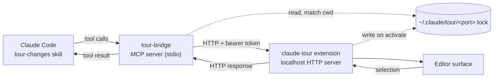

# tour-changes: VS Code editor bridge v1

Date: 2026-09-21

This document owns transport, pairing, editor operations, and tests. It does
not own the larger product claim that a tour closes the reviewer's
understanding gap — see
[`tour-changes: product spec`](2026-09-21-tour-changes-product-spec.md) for
review outcomes, tour state, evidence, provenance, and success metrics.

## Problem

The `tour-changes` skill narrates a diff stop by stop, citing code as
`path:line`. The terminal renders those citations as clickable links, but the
reviewer still does the navigating. A real walkthrough is the opposite: the
author drives the screen, opens the file, and points at the lines while
talking.

This design gives the skill the ability to drive VS Code directly — open a
stop's files, highlight its ranges, point at a specific line mid-sentence, and
read back whatever the reviewer highlights when they interrupt with a question.

## Goals

- The skill opens and highlights code as it narrates, without the reviewer clicking anything.
- A stop spanning multiple files renders in VS Code's native multi-file diff editor.
- Within a stop, the skill can point at successively narrower ranges without re-opening files.
- When the reviewer asks "what's this?", the skill can read what they are looking at — selection, cursor, or enclosing symbol.
- Every coordinate the bridge carries is unambiguous about which side of which revision it names.
- Ships as an installable marketplace plugin that works across agentic coding tools, not Claude Code alone.
- Degrades to a text-and-links tour, with the loss stated plainly, when the extension is unavailable.

## Non-goals

- Editors other than VS Code. The *agent* is portable; the *editor* is not.
- A sidebar or tree view of stops. The reviewer-facing agenda ships as terminal text in v1.
- Modifying repository source or configuration as part of a tour.

That last non-goal is deliberately narrower than "no write path." Ephemeral
decorations, local review state, comment threads, and exportable review
receipts are all compatible with it; none of them touch the repository. The
bridge protocol in v1 has no verb that writes anything at all, but that is a v1
scope decision rather than a permanent invariant.

## Prior art and rejected approaches

**Claude Code's own IDE bridge.** The Claude Code VS Code extension runs an MCP
server over a WebSocket, discovered via `~/.claude/ide/<port>.lock`. It exposes
`openFile` (with `startText`/`endText` range anchors), `openDiff`,
`getCurrentSelection`, and `getOpenEditors` — close to exactly what this design
needs. Claude Code surfaces only `getDiagnostics` and `executeCode` to the
model, so using the rest would mean connecting to that WebSocket as a third
party.

Rejected after probing it live: informational tools (`getWorkspaceFolders`)
answer a third-party client, but every editor-manipulating tool accepts the
call and never replies. It is also undocumented, coupled to the extension
version, and shares a channel Claude Code itself depends on.

**`code` CLI shell-out.** `code --goto <file>:<line>:<col>` works and needs no
install, but places a cursor rather than highlighting a range, and cannot
decorate or clear. `code --open-url` is not supported in the WSL remote CLI
(build 1.138.0) — it treats the URI as a filesystem path and creates a
directory. That rules out URI-handler dispatch in this environment.

**CodeTour (`vsls-contrib.codetour`).** Renders authored `.tours/*.tour` files
as a navigable sidebar. Rejected: navigation is reviewer-driven rather than
author-driven, steps are line-anchored with no diff awareness, and there is no
path to read the reviewer's selection back.

**`estaples.git-vscode-diff`** is retained as-is. Its `changedFiles`,
`resourceTriple`, and `gitUri` helpers are lifted into the new extension for
the multi-file diff path.

## Architecture

Three processes, two hops. See `diagram.md` at the repository root for the
rendered flow.



The MCP server is a stateless proxy: resolve which editor window owns the
current working directory, forward the request, return the response. All editor
state lives in the extension.

HTTP rather than WebSocket because every interaction is request/response. A
future sidebar needing server push can add an SSE endpoint without disturbing
this.

## Pairing

The extension binds `127.0.0.1:0`, reads the assigned port, and writes
`~/.claude/tour/<port>.lock` with mode `0600`:

```json
{
  "protocolVersion": 1,
  "port": 53411,
  "authToken": "<random 32 bytes, base64url>",
  "pid": 1472,
  "ideName": "Visual Studio Code",
  "extensionVersion": "0.1.0",
  "workspaceFolders": ["/home/estaples/code/github.com/erstaples/example"]
}
```

The file is deleted on `deactivate`.

Resolution, performed by the MCP server on every call:

1. Read every `*.lock` in `~/.claude/tour/`.
2. Drop any whose `pid` fails `process.kill(pid, 0)` with `ESRCH`, unlinking the file.
3. Keep locks where the server's cwd is equal to, or contained by, one of `workspaceFolders`.
4. Exactly one survivor → use it. Longest matching prefix wins among nested workspaces.
5. Zero → error naming the likely cause (extension not installed, or workspace not open).
6. More than one after prefix comparison → error listing the candidate workspaces. Never guess.

`protocolVersion` mismatch between lockfile and MCP server is a hard error
naming both versions.

## HTTP protocol

All requests carry `Authorization: Bearer <authToken>` and
`{"protocolVersion": 1}`. The server binds loopback only and rejects requests
whose `Origin` header is present (defense against DNS-rebinding from a browser).

**Line numbers are 1-based and inclusive throughout the protocol**, matching git
and the editor gutter. Conversion to VS Code's 0-based `Position` happens at the
extension boundary and nowhere else.

**Paths are repository-relative**, resolved against the matched workspace folder
by the extension. This matches the skill's existing citation convention.

### Diff identity and coordinates

A line number alone does not identify code in a diff. On a modified file, line
40 of the base and line 40 of the head are different content, and a range over
deleted lines exists only on the base side. Every coordinate in this protocol
therefore carries a `side`:

| `side` | Content |
|---|---|
| `base` | The file at the pinned base commit |
| `head` | The file at the pinned head commit |
| `working` | The file on disk, including uncommitted changes |

**Refs are pinned to immutable commit IDs.** The skill resolves `main`/`HEAD`
through `git rev-parse` once, at tour start, and the protocol carries only the
resulting SHAs. Names are retained alongside for display. A commit, rebase, or
checkout mid-tour cannot silently repoint a stop.

The pinned pair is the **tour's diff identity**, established by the first
`tour_stop` call and constant for the tour's life. `/stop` rejects a request
whose `base`/`head` differ from the established identity.

### Uncommitted work

A tour of uncommitted changes has no stable "after" side. v1 resolves this
explicitly rather than silently:

- `head` may be the literal string `"WORKTREE"` instead of a SHA.
- When it is, the extension records a SHA-256 of each file it opens, at the moment it opens it.
- Every subsequent `/stop`, `/focus`, and `/context` re-hashes the files it touches. A mismatch returns `content_drift` naming the changed files.

The skill's response to `content_drift` is to stop and tell the reviewer, not
to re-resolve silently. Detecting drift is in v1 scope; *recovering* from it by
rebuilding the tour is deferred to the product spec.

Snapshotting dirty content to a temp ref was considered and rejected for v1: it
doubles the state to manage and the failure it prevents — the reviewer editing
during their own review — is better surfaced than hidden.

### `POST /stop`

Sets the scene for a tour stop.

```json
{
  "protocolVersion": 1,
  "stopId": "s2",
  "index": 2,
  "total": 7,
  "label": "Extract the retry policy",
  "type": "implementation",
  "mode": "diff",
  "base": { "sha": "4f2a9c1…", "name": "main" },
  "head": { "sha": "8b71e03…", "name": "HEAD" },
  "files": [
    { "path": "internal/retry/policy.go",
      "ranges": [{ "side": "head", "startLine": 12, "endLine": 48 }] },
    { "path": "internal/client/do.go",
      "ranges": [{ "side": "base", "startLine": 88, "endLine": 94 },
                 { "side": "head", "startLine": 88, "endLine": 91 }] }
  ]
}
```

`type` is one of `context`, `implementation`, `risk`, `evidence`, or
`limitation`. v1 records it and lets the extension vary the decoration; the
narration semantics belong to the product spec.

`index`/`total` let the extension render progress without holding tour state.

- `mode: "diff"` — opens the listed files in the native multi-file diff editor via the `vscode.changes` command, titled `label`. Requires `base` and `head`. Left side is a `git:` URI at `base`, right side at `head`; added files omit the left, deleted files omit the right.
- `mode: "file"` — opens the working-tree files as normal editors and applies the stop decoration to `ranges`.

Either mode replaces the previous stop's decorations. Response:

```json
{ "ok": true, "opened": ["internal/retry/policy.go", "internal/client/do.go"] }
```

### `POST /focus`

Points at one range inside the current stop. Reveals it with
`TextEditorRevealType.InCenterIfOutsideViewport` and applies the focus
decoration.

```json
{
  "protocolVersion": 1,
  "path": "internal/retry/policy.go",
  "side": "head",
  "startLine": 31,
  "endLine": 35,
  "note": "backoff is capped here, not in the caller"
}
```

`note`, when present, renders as inline `after`-text at the end of `endLine`.

Focus does not move the cursor or set `editor.selection`. The selection belongs
to the reviewer; overwriting it would corrupt what `GET /context` reports.

### `POST /clear`

Clears both decoration types across all visible editors. Does not close tabs.

### `GET /context`

Answers "what is the reviewer looking at?" — not "what did they select?"
Reviewers park a cursor, scroll to a region, or say "this function" without
highlighting anything, so a selection-only endpoint would fail the common case.

```json
{
  "ok": true,
  "context": {
    "path": "internal/retry/policy.go",
    "side": "head",
    "cursor": { "line": 33, "character": 8 },
    "selection": { "startLine": 31, "endLine": 35, "text": "…" },
    "symbol": { "name": "capBackoff", "kind": "function", "startLine": 28, "endLine": 41 },
    "visibleRange": { "startLine": 18, "endLine": 52 },
    "nearby": { "before": "…", "after": "…" },
    "stopId": "s2",
    "focus": { "path": "internal/retry/policy.go", "side": "head", "startLine": 31, "endLine": 35 }
  }
}
```

`selection` is `null` when nothing is highlighted; every other field is still
populated. `symbol` comes from `vscode.executeDocumentSymbolProvider` and is
`null` when no language server is available.

`nearby` carries 10 lines either side **as a fast path, not as context.** The
skill is expected to read definitions, callers, tests, or history when the
question needs them. Proximity is not semantic relevance, and the protocol
should not tempt the model into treating it as such.

Returns `no_active_editor` when no editor is focused.

### `GET /status`

```json
{
  "ok": true,
  "protocolVersion": 1,
  "extensionVersion": "0.1.0",
  "ideName": "Visual Studio Code",
  "workspaceFolders": ["/home/estaples/code/github.com/erstaples/example"]
}
```

### Errors

Non-2xx responses carry `{ "ok": false, "error": { "code": "...", "message": "..." } }`.
Codes: `unauthorized`, `protocol_mismatch`, `bad_request`, `file_not_found`,
`range_out_of_bounds`, `git_failed`, `no_active_editor`, `content_drift`,
`diff_identity_mismatch`.

## Decorations

Two `TextEditorDecorationType` instances, created once at activation and
disposed at deactivation. Clearing is `setDecorations(type, [])`.

| Type | Appearance |
|---|---|
| `stopRange` | Subtle whole-line background, gutter bar, `overviewRulerColor` so the stop's extent shows in the scrollbar ruler |
| `focusRange` | Stronger background, 1px border, optional `after` contentText carrying `note` |

Colors come from `ThemeColor` references rather than literals, so the
highlights track the reviewer's theme in both light and dark.

### Decorating the multi-file diff editor

`setDecorations` requires a concrete `TextEditor`, and the multi-file diff
editor does not obviously provide them. A throwaway extension was built to
settle this against VS Code 1.138.0. Findings:

- `vscode.changes` produces a `TabInputTextMultiDiff` tab whose `textDiffs` array carries an `original`/`modified` `git:` URI pair per file. The `ref` in each URI's query is the authoritative side marker, so `side` maps to a ref and an editor is identified by `(path, ref)`.
- `setDecorations` **succeeds** on the diff editor's editors. Both sides accept decorations, and `revealRange` works.
- **Editors materialize lazily.** With two files in the diff, only one file's pair appeared in `window.visibleTextEditors` after the tab opened. The other had no editor at all.

That last point is the load-bearing one. The extension cannot decorate a stop's
files eagerly. It must:

1. Store the stop's decoration intent — `(path, side, ranges)` — in extension state.
2. Apply to whatever editors currently exist.
3. Subscribe to `window.onDidChangeVisibleTextEditors` and apply to matching editors as they materialize.
4. Drop the intent on `/clear` or on the next `/stop`.

The response to `/stop` reports which files were decorated immediately versus
deferred, so the skill never claims to be pointing at something the reviewer
cannot see.

## MCP tool surface

Five tools, exposed by `mcp/server.js` over stdio.

| Tool | Args | Maps to |
|---|---|---|
| `tour_status` | — | `GET /status` |
| `tour_stop` | `label`, `mode`, `base?`, `head?`, `files[{path, ranges[{startLine, endLine}]}]` | `POST /stop` |
| `tour_focus` | `path`, `startLine`, `endLine`, `note?` | `POST /focus` |
| `tour_clear` | — | `POST /clear` |
| `tour_context` | — | `GET /context` |

`tour_focus` exists separately from `tour_stop` because re-opening a file for
every sentence is not what a human walkthrough looks like. The author opens once
and points repeatedly.

The protocol has no write verbs, so the skill's "never edit files" constraint
holds by construction rather than by instruction.

## Repository layout

```
claude-code-review-walkthrough/
├── .claude-plugin/
│   ├── marketplace.json
│   └── plugin.json
├── .mcp.json
├── skills/tour-changes/SKILL.md
├── mcp/
│   ├── server.js
│   └── lockfile.js
├── editor-extension/
│   ├── extension.js
│   ├── server.js
│   ├── decorations.js
│   ├── git.js
│   ├── package.json
│   └── README.md
├── test/
├── install.sh
├── diagram.md
├── README.md
└── LICENSE
```

`marketplace.json` declares a single plugin with `source: "./"`, matching the
shape of the author's existing `claudecode-taskw` repository.

`.mcp.json` registers the bridge:

```json
{
  "mcpServers": {
    "tour-bridge": {
      "command": "node",
      "args": ["${CLAUDE_PLUGIN_ROOT}/mcp/server.js"]
    }
  }
}
```

## Cross-agent compatibility

The bridge is a standard stdio MCP server, so any MCP-capable agent can drive
it. What varies between agents is how the *procedure* — the skill — gets
loaded, and how the server gets registered.

### Verified: Codex installs this plugin as-is

Probed against Codex CLI 0.155.1 by installing a synthetic plugin and
inspecting the result:

- `.claude-plugin/marketplace.json` is the manifest Codex accepts. `.codex-plugin/marketplace.json`, bare `marketplace.json`, and `.agent-plugin/marketplace.json` are all rejected with "marketplace root does not contain a supported manifest". No second manifest is needed, and adding one would not help.
- `skills/<name>/SKILL.md` loads unchanged. Codex namespaces entries as `plugin_name:skill_name` and surfaces them in the same skills list Claude Code uses.
- `.mcp.json` servers are registered and appear in `codex mcp list`.
- `commands/*.md`, if present, are auto-migrated into `.codex-plugin/migrated-command-skills/`.

The consequence is that the repository layout below needs no per-agent
duplication. One manifest, one skill file, one MCP registration.

### The `${CLAUDE_PLUGIN_ROOT}` question

`codex mcp get` displays the variable unexpanded, but the `codex` binary
contains the string `CLAUDE_PLUGIN_ROOT` (and no `CODEX_PLUGIN_ROOT`), which
suggests it substitutes at launch. **This is the one unverified assumption in
the cross-agent story** and must be confirmed during implementation by
launching a server that logs its own resolved path.

If it does not substitute, `install.sh` registers the server explicitly with an
absolute path resolved at install time:

```
codex mcp add tour-bridge -- node "$PLUGIN_ROOT/mcp/server.js"
```

This fallback is cheap, so it is worth shipping the check in `install.sh`
regardless: detect a literal `${CLAUDE_PLUGIN_ROOT}` in `codex mcp get
tour-bridge` output and re-register if found.

### Agents without a plugin system

Cursor, Gemini CLI, Windsurf, and similar tools have no plugin manifest but do
support stdio MCP servers. Their install path is two manual steps: register
`node <abs>/mcp/server.js` in the tool's MCP config, and point the tool's rules
file at `skills/tour-changes/SKILL.md`.

`SKILL.md` is the single source of truth for the procedure. It is not
duplicated into `AGENTS.md`, `.cursor/rules`, or any per-agent variant —
the README instructs users to reference the file rather than copy it, so there
is nothing to drift.

### Constraints this places on the skill body

The skill must not assume Claude Code specifics. Concretely: no references to
sibling Claude skills by slash name (the current draft points at
`/code-review` and `address-coderabbit`), no assumptions about Claude Code's
tool names beyond the `tour_*` MCP tools, and no reliance on terminal rendering
behavior. Path citations stay, since every agent's terminal renders them
usefully or harmlessly.

### Zero dependencies on both sides

Plugin installation does not run `npm install`, so depending on
`@modelcontextprotocol/sdk` would require vendoring `node_modules` into the
repository. MCP over stdio is line-delimited JSON-RPC 2.0 with three methods
(`initialize`, `tools/list`, `tools/call`) — direct implementation is roughly
150 lines. The extension side has no dependencies either, matching
`git-vscode-diff`.

Consequence: `node` must be on `PATH` for whichever agent launches the server.
`install.sh` checks for `node` and the `code` CLI, installs the packaged
`.vsix`, and then — for each agent it detects — verifies the MCP registration,
re-registering with an absolute path if variable substitution did not happen.

## Skill changes

`SKILL.md` moves to `skills/tour-changes/SKILL.md`, which also resolves the
lint warning that the skill name must match its containing folder.

Voice generalizes from "Eric" to second person, and trigger phrases in the
frontmatter `description` become generic. References to sibling Claude Code
skills are removed per the cross-agent constraints above.

Workflow changes:

- **Step 1 — range.** Inspect the repository and *propose* the likely review range with its resolved SHAs, rather than asking the reviewer to formulate a git range. Ask only when genuinely ambiguous. Then `git rev-parse` both ends and pin them for the tour.
- **Step 1 — preflight.** Call `tour_status`. On success, run the driven tour. On failure, state which capabilities are unavailable, give the one-line install path, and continue as a text-and-links tour. The tour is never blocked on the extension.
- **Step 3 — agenda.** Present a compact agenda before the first stop: the problem and intended outcome, the stops with types, which are foundational versus supporting, which carry risk or uncertainty, and a rough sense of depth. The previous instruction to build the list silently is reversed. Detail per stop is still deferred until that stop is reached.
- **Step 4** calls `tour_stop` before narrating and `tour_focus` when zooming into a specific construct mid-narration.
- **Question handling** calls `tour_context` first when the reviewer's question is deictic ("what's this?", "why here?"). `nearby` is a fast path; read definitions, callers, tests, or history when the question needs them.
- **Step 5** ends with `tour_clear`.

Navigation is reviewer-available, not reviewer-required: `next`, `back`,
`jump <stop>`, `skip`, `pause`, `resume`, and `overview` are all honored at any
pause. The agent still drives by default. Persisting this across sessions
belongs to the product spec; honoring it within one conversation does not.

### Rationale provenance

Every "why" is labeled as one of: **stated** by the user or specification,
**recorded** by the coding agent during implementation, **repository-derived**
from commits, comments, or docs, or **reconstructed** by the presenting agent.
The existing two-way stated/inferred distinction is not enough when the tour
guide may be a different agent invocation than the author — a reconstructed
rationale can be fluent and wrong. Capturing the *recorded* category at
authoring time is deferred; labeling it when present is not.

### Stop types and concerns

Stops are typed (`context`, `implementation`, `risk`, `evidence`,
`limitation`), and the agenda shows the types. A tour that is entirely
`implementation` stops is a signal the framing and evidence phases were
skipped.

The concerns guidance broadens beyond repository-convention violations to
behavior and failure handling, observability, migration and rollout safety,
and maintainability. The instruction not to manufacture concerns stands.

### Bulk and generated changes

A stop spanning dozens of files usually means the unit is too broad or the
change is mechanical. Classify it, explain what generated or transformed it,
walk one or two representative examples, and state explicitly what was not
individually reviewed. Do not silently narrate 40 files as one stop, and do not
pad it into 40 stops.

### Citations

The every-mention citation rule is relaxed. With the editor being driven,
`path:line` is required for stop headers, jumps to code outside the visible
stop, answers the reviewer may want to revisit, and the closeout. The editor
carries moment-to-moment pointing; the transcript carries durable references.
Under the text-only fallback the original every-mention rule applies, since
citations are then the only navigation the reviewer has.

## Testing

**MCP server** — unit tests over the JSON-RPC framing and lockfile resolution,
against a fake lock directory: zero locks, one lock, multiple locks with nested
workspace folders, a stale lock whose pid is dead, a lock with a mismatched
`protocolVersion`. HTTP forwarding is tested against a stub server.

**Extension** — `@vscode/test-electron` integration tests driving the HTTP
surface in a real Extension Development Host: `/status` shape, `/stop` in both
modes opening the expected tabs, `/focus` range conversion at file boundaries
(line 1 and last line), `/context` with and without an active selection,
`/clear` removing decorations. Auth is tested by asserting a missing or wrong
bearer token yields `unauthorized`.

**End to end** — a scripted tour over a fixture repository with a known diff,
asserting the sequence of tabs and decorations.

Development follows TDD per the repository's superpowers workflow.

## Open risks

- `vscode.changes` and `TabInputTextMultiDiff` are built-ins without a formal API contract. Both were verified against 1.138.0, and `git-vscode-diff` already depends on the former, but a breaking change would require falling back to per-file `vscode.diff`.
- Lazy editor materialization means a stop's decorations land over time rather than at once. The `/stop` response distinguishes applied from deferred, but a file the reviewer never scrolls to is never decorated. Acceptable for v1; a signal that stops should stay small.
- `${CLAUDE_PLUGIN_ROOT}` substitution in Codex remains unverified. `install.sh` carries the check and fallback.
- Remote/WSL split installs. The extension must run on the same side as the workspace. `install.sh` installs into the active remote and `tour_status` reports the resolved workspace so a mismatch is visible immediately.

## Explicitly deferred

Raised in the design review and deliberately out of v1 scope. Each needs a
state model or a UI subsystem rather than a protocol field, and each is owned
by the product spec.

| Deferred | v1 enabler already in place |
|---|---|
| Review ledger and exportable receipt | Non-goal narrowed to "no repository writes", so nothing blocks it |
| Cross-session pause/resume | Pinned SHAs and `content_drift` give it a stable identity to resume against |
| Evidence stops — tests, diagnostics, runtime | `type: "evidence"` exists; the skill can cite tests textually |
| Narration inside the editor (Comment API or webview) | `note` on `/focus` covers short pointing text |
| Sidebar tree view with progress | `stopId`, `index`, `total` are on the wire; the agenda ships as terminal text |
| Provenance captured during the authoring session | The four-way provenance labels apply as soon as an artifact exists |
| Adversarial review merged into each stop | Concerns guidance already broadened beyond conventions |
| Comprehension and ownership checks | — |
| Success metrics and comparative study | — |

The v1 protocol is designed so none of these requires a breaking change: they
add endpoints, fields, or skill behavior on top of a diff identity that is
already immutable and coordinates that are already unambiguous.
